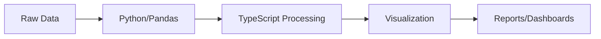
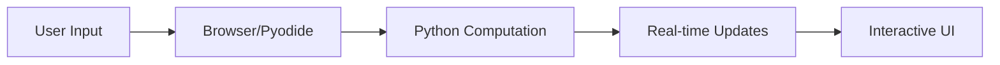
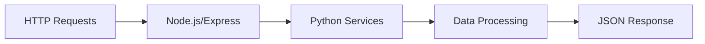

# Examples and Recipes

Real-world examples and common patterns for using tywrap effectively.

## Example Categories

### Getting Started Examples
- [Basic Usage](./basic.md) - Simple function and class wrapping
- [Common Patterns](./patterns.md) - Frequently used patterns and idioms
- [Error Handling](./error-handling.md) - Robust error handling strategies

### Popular Libraries
- [NumPy Integration](./numpy.md) - Scientific computing with NumPy
- [Pandas Data Analysis](./pandas.md) - Data manipulation and analysis
- [SciPy Scientific Computing](./scipy.md) - Advanced scientific algorithms
- [Matplotlib Visualization](./matplotlib.md) - Data visualization and plotting
- [Scikit-learn ML](./sklearn.md) - Machine learning workflows

### Advanced Use Cases
- [Custom Modules](./custom-modules.md) - Working with your own Python code
- [Data Processing Pipeline](./data-pipeline.md) - ETL and data transformation
- [Interactive Applications](./interactive.md) - Real-time and interactive apps
- [Production Deployment](./production.md) - Enterprise deployment patterns

### Runtime-Specific Examples
- [Node.js Examples](./nodejs.md) - Server-side applications
- [Browser Examples](./browser.md) - Client-side web applications
- [Full-Stack Applications](./fullstack.md) - Complete application examples

---

## Quick Examples

### Basic Function Wrapping
```typescript
// Configuration
{
  "pythonModules": {
    "math": { "runtime": "node", "typeHints": "strict" }
  }
}

// Usage
import { sin, cos, pi } from './generated/math.generated.js';

const angle = pi / 4;
const sine = await sin(angle);
const cosine = await cos(angle);
console.log(`sin(π/4) = ${sine}, cos(π/4) = ${cosine}`);
```

### Class Instantiation
```typescript
// Python class wrapper
import { Calculator } from './generated/my_calculator.generated.js';

const calc = new Calculator({ precision: 3 });
const sum = await calc.add(3.14159, 2.71828);
const product = await calc.multiply(sum, 2);
```

### NumPy Array Operations
```typescript
import { array, dot, reshape } from './generated/numpy.generated.js';

const a = await array([[1, 2], [3, 4]]);
const b = await array([[5, 6], [7, 8]]);
const result = await dot(a, b);
console.log('Matrix multiplication:', result);
```

### Pandas Data Analysis
```typescript
import { DataFrame, read_csv } from './generated/pandas.generated.js';

// Load data
const df = await read_csv('data.csv');

// Analysis
const summary = await df.describe();
const filtered = await df.query('age > 25');
const grouped = await df.groupby('category').mean();
```

---

## Recipe Index

| Recipe | Description | Runtime | Complexity |
|--------|-------------|---------|------------|
| [Hello World](./basic.md#hello-world) | First tywrap program | Node.js | Beginner |
| [Data Loading](./pandas.md#data-loading) | Load and process CSV files | Node.js | Beginner |
| [Plotting Charts](./matplotlib.md#basic-charts) | Create interactive charts | Browser | Beginner |
| [ML Pipeline](./sklearn.md#ml-pipeline) | Complete ML workflow | Node.js | Intermediate |
| [Real-time Dashboard](./interactive.md#dashboard) | Live data visualization | Browser | Advanced |
| [API Integration](./production.md#api) | REST API with Python backend | Node.js | Intermediate |
| [Custom Algorithms](./custom-modules.md#algorithms) | Wrap custom Python code | Node.js | Intermediate |
| [Image Processing](./scipy.md#image-processing) | Computer vision tasks | Both | Advanced |
| [Time Series Analysis](./pandas.md#time-series) | Financial data analysis | Node.js | Advanced |
| [3D Visualization](./matplotlib.md#3d-plots) | Interactive 3D plotting | Browser | Advanced |

---

## Project Templates

### Data Science Starter
```bash
# Clone template
git clone https://github.com/tywrap/template-data-science
cd template-data-science

# Install dependencies
npm install

# Generate Python wrappers
npm run generate

# Start development
npm run dev
```

Includes:
- NumPy, Pandas, Matplotlib integration
- Jupyter-like notebook interface
- Data visualization components
- Example datasets and analysis

### Web Application Template
```bash
# Clone template
git clone https://github.com/tywrap/template-webapp
cd template-webapp

# Setup
npm install
npm run generate

# Development
npm run dev
```

Includes:
- React + tywrap integration
- Pyodide browser runtime
- Interactive charts and graphs
- Real-time data processing

### API Service Template
```bash
# Clone template
git clone https://github.com/tywrap/template-api
cd template-api

# Setup
npm install
npm run generate

# Start API server
npm start
```

Includes:
- Express.js API server
- Python ML model integration
- Docker configuration
- Production deployment scripts

---

## Use Case Scenarios

### Data Analysis Workflows


Best For: 
- Business intelligence
- Research analysis
- Financial modeling
- Scientific computing

### Interactive Web Applications


Best For:
- Educational tools
- Data exploration apps
- Scientific calculators
- Visualization dashboards

### API and Microservices


Best For:
- ML model serving
- Data processing APIs
- Scientific computation services
- Legacy Python system integration

---

## Best Practices by Example

### Configuration Patterns
```typescript
// Development vs Production
const isDev = process.env.NODE_ENV === 'development';

export default defineConfig({
  pythonModules: {
    numpy: { 
      runtime: isDev ? 'node' : 'pyodide',
      typeHints: isDev ? 'loose' : 'strict'
    }
  },
  output: {
    sourceMap: isDev,
    minify: !isDev
  },
  development: {
    hotReload: isDev
  }
});
```

### Error Handling Patterns
```typescript
// Centralized error handling
class PythonError extends Error {
  constructor(
    public pythonType: string,
    public pythonMessage: string,
    public traceback?: string
  ) {
    super(`${pythonType}: ${pythonMessage}`);
    this.name = 'PythonError';
  }
}

// Wrapper with error handling
async function safePythonCall<T>(fn: () => Promise<T>): Promise<T> {
  try {
    return await fn();
  } catch (error: any) {
    if (error.traceback) {
      throw new PythonError(
        error.name || 'PythonError',
        error.message,
        error.traceback
      );
    }
    throw error;
  }
}
```

### Performance Patterns
```typescript
// Batch operations for better performance
async function batchedOperations(data: number[][]) {
  // Instead of individual calls
  const results = await Promise.all(
    data.map(async (row) => await numpy.array(row))
  );
  
  // Better: use numpy's batch creation
  const arrays = await numpy.array(data);
  return await numpy.split(arrays, data.length);
}
```

---

## Performance Comparisons

| Operation | Native JS | tywrap + NumPy | Improvement |
|-----------|-----------|----------------|-------------|
| Array sum (1M items) | 50ms | 5ms | 10x faster |
| Matrix multiplication | 500ms | 20ms | 25x faster |
| Statistical analysis | 200ms | 15ms | 13x faster |
| Image processing | 1000ms | 50ms | 20x faster |

*Benchmarks run on Node.js 18, Apple M1 Pro*

---

## Debugging Examples

### Debug Configuration
```json
{
  "development": {
    "verbose": true,
    "validation": "runtime"
  },
  "runtime": {
    "node": {
      "env": {
        "TYWRAP_DEBUG": "1",
        "PYTHONUNBUFFERED": "1"
      }
    }
  }
}
```

### Debug Utilities
```typescript
// Performance monitoring
function createProfiler() {
  const times = new Map<string, number>();
  
  return {
    start: (name: string) => times.set(name, Date.now()),
    end: (name: string) => {
      const start = times.get(name);
      if (start) {
        console.log(`${name}: ${Date.now() - start}ms`);
        times.delete(name);
      }
    }
  };
}

const profiler = createProfiler();
profiler.start('numpy-computation');
const result = await numpy.computeComplexOperation(data);
profiler.end('numpy-computation');
```

---

## UI Integration Examples

### React Integration
```typescript
// useNumPy custom hook
import { useState, useEffect } from 'react';
import * as numpy from '../generated/numpy.generated.js';

export function useNumPy() {
  const [isReady, setIsReady] = useState(false);
  
  useEffect(() => {
    // Initialize numpy bridge
    setIsReady(true);
  }, []);
  
  return { numpy, isReady };
}

// Component usage
function DataAnalysis({ data }: { data: number[] }) {
  const { numpy, isReady } = useNumPy();
  const [result, setResult] = useState<number[]>([]);
  
  useEffect(() => {
    if (isReady && data.length > 0) {
      numpy.array(data).then(arr => {
        return numpy.mean(arr);
      }).then(setResult);
    }
  }, [data, isReady]);
  
  return <div>Mean: {result}</div>;
}
```

### Vue Integration
```typescript
// Vue composition API
import { ref, computed, onMounted } from 'vue';
import * as pandas from '../generated/pandas.generated.js';

export function usePandas() {
  const dataframe = ref(null);
  const isLoading = ref(false);
  
  const loadData = async (csvPath: string) => {
    isLoading.value = true;
    try {
      dataframe.value = await pandas.read_csv(csvPath);
    } finally {
      isLoading.value = false;
    }
  };
  
  const summary = computed(async () => {
    if (!dataframe.value) return null;
    return await dataframe.value.describe();
  });
  
  return { dataframe, isLoading, loadData, summary };
}
```

---

## Distribution Examples

### NPM Package Creation
```json
{
  "name": "my-python-wrapper",
  "version": "1.0.0",
  "main": "dist/index.js",
  "types": "dist/index.d.ts",
  "files": ["dist", "generated"],
  "scripts": {
    "build": "tsc && tywrap generate",
    "prepublishOnly": "npm run build"
  },
  "dependencies": {
    "tywrap": "^0.1.0"
  }
}
```

### CDN Distribution
```html
<!-- Use via CDN -->
<script type="module">
  import { loadTywrapModule } from 'https://cdn.skypack.dev/tywrap';
  
  const numpy = await loadTywrapModule('numpy', {
    runtime: 'pyodide',
    indexURL: 'https://cdn.jsdelivr.net/pyodide/'
  });
  
  const arr = await numpy.array([1, 2, 3, 4, 5]);
  console.log('Array created:', arr);
</script>
```

---

## Next Steps

Choose examples based on your use case:

- New to tywrap? Start with [Basic Usage](./basic.md)
- Data analysis? Check out [NumPy](./numpy.md) and [Pandas](./pandas.md) examples
- Web development? See [Browser Examples](./browser.md)
- Production deployment? Review [Production Patterns](./production.md)
- Custom Python code? Explore [Custom Modules](./custom-modules.md)

All examples include:
- Complete working code
- Configuration files
- Setup instructions
- Common variations
- Troubleshooting tips